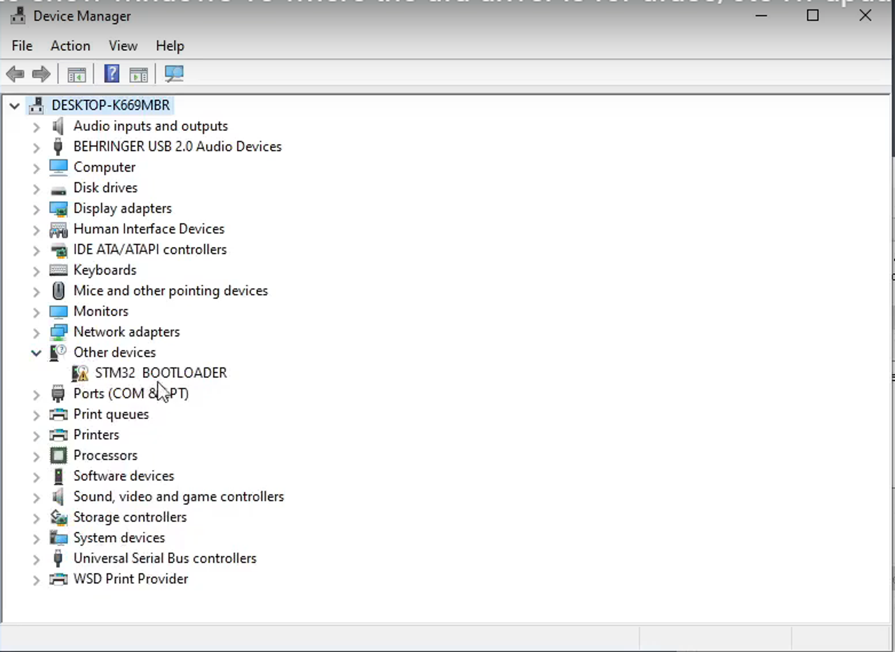

# TTGO T-Impulse

Created by: Roshan Kattel
Created time: October 26, 2023 7:07 PM

# Development Environment Setup

## I. Drivers Installation in Windows device

1. Install **STM32CubeProgrammer software** ****from STM32 official website****
    
    [STM32CubeProg - STMicroelectronics](https://www.st.com/en/development-tools/stm32cubeprog.html)
    
2. Ensure the TTGO device is connected to the PC with a High-quality Type C cable. **(Recommended Type C to Type C cable)**
3. Open Device Manager. If you see a device listed in the “Other devices” section this means the driver is not installed properly there are extra steps to be carried out.
Else, You can go to step 6.



1. Download and Install “****STSW-STM32080”**** from the link below 

[STSW-STM32080 - STMicroelectronics](https://www.st.com/en/development-tools/stsw-stm32080.html)

1. Go to the device manager and update the firmware of the device as instructed in this video 

[how to show windows 10 where the dfu driver is for dfuse/ct5 fw updates](https://www.youtube.com/watch?v=8rPN5-Ce2cc)

1. Change the state of the TTGO device to programming mode
    1. When the device is connected to the PC **press** and **hold** the boot button 
    2. Then, **press** the reset button once and **release** the boot button. 
    
    **Note - You will hear the sound of a USB plugged into windows** 
    
2. After you follow the steps you can see the drivers are properly installed in DFU mode 


1. Now Replace the Driver using Zadiag
- Open the device manager, as shown in the figure, and you will find `STM Device in DFU Mode`. At this time, the firmware cannot be uploaded. You need to use [zadig](https://zadig.akeo.ie/) to replace the original driver. The operation steps are as follows
    
    
    
- Choose `STM32 BOOLTOADER`,Note not `NUCLEO_L073RZ CDC in FS Mode`.
    
    
    
- Click Replace Driver
    
    
    
    
    

***Hence, The driver installation is successful.*** 

## II. Upload code using Arduino IDE

1. Download [Arduino IDE](https://www.arduino.cc/en/software)
2. Open Arduino, open preferences-> add to the board installation manager address list

```jsx
https://raw.githubusercontent.com/stm32duino/BoardManagerFiles/main/package_stmicroelectronics_index.json
```

1. Open the board installation manager, wait for the index update to complete, select 'STM32 MCU based boards' and click install
2. Copy all the folders in the lib from [here](https://github.com/Xinyuan-LilyGO/T-Impulse/tree/master/lib) directory to

 `"C:\User\<YourName>\Documents\Arduino\libraries"`

1. Change the state of the TTGO device to programming mode
    1. When the device is connected to the PC **press** and **hold** the boot button 
    2. Then, **press** the reset button once and **release** the boot button. 
    
    **Note - You will hear the sound of a USB plugged into windows** 
    
2. Select the parameters as shown in the figure below 
    
    **Note - Here the port is dfu-port** 
    


1. Upload the S76G Factory code from the example. After completion, it will look like something like this 


1. Open the Serial port with the 115200 baud rate you can see the device logs 


### Useful Links

[https://github.com/Xinyuan-LilyGO/T-Impulse](https://github.com/Xinyuan-LilyGO/T-Impulse)

[](https://github.com/stm32duino/BoardManagerFiles/raw/main/package_stmicroelectronics_index.json)

[GitHub - stm32duino/Arduino_Core_STM32: STM32 core support for Arduino](https://github.com/stm32duino/Arduino_Core_STM32#getting-started)

[Bracelet Edition](https://github.com/lyusupov/SoftRF/wiki/Bracelet-Edition)

[https://github.com/xoseperez/s7xg](https://github.com/xoseperez/s7xg)

[https://www.youtube.com/watch?v=8rPN5-Ce2cc](https://www.youtube.com/watch?v=8rPN5-Ce2cc)